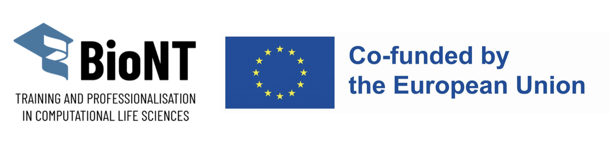

# BioNT

[BioNT](https://biont-training.eu/training.html) is an international consortium dedicated to providing high-quality training and fostering a community for digital skills in the biotechnology and biomedical sectors. The project's training model is built on three core missions:

## Course name

- Applied Machine Learning for Biological Data

## Course description

- [Description provided in the course registration page](https://www.cecam.org/workshop-details/1465)

## Workshop structure and link to learning materials

### Module 1

- [Introduction to Module 1](https://coderefinery.github.io/NumPy-and-Pandas-fundamentals-for-handling-biological-datasets/) 

| Day | Topics                                                                                                         |
| --- | -------------------------------------------------------------------------------------------------------------- |
| 1   | [NumPy: Fundamentals](https://coderefinery.github.io/NumPy-and-Pandas-fundamentals-for-handling-biological-datasets/0.Numpy_for_bioinformatics/) |
| 2   | [Pandas: Fundamentals](https://coderefinery.github.io/NumPy-and-Pandas-fundamentals-for-handling-biological-datasets/7.Pandas_lesson%20plan/) |

### Module 2

- [Introduction to Module 2](https://www.cecam.org/workshop-details/1465) 

| Day | Topics                                                                                                         |
| --- | -------------------------------------------------------------------------------------------------------------- |
|  1   | [ML terminology and ML in Bioinformatics](Day1/0_Introduction_ml_terminology.pdf)                                                                                                                     |
|     | [Unsupervised Learning: Clustering (K-Means Clustering, Hierarchical clustering, Clustering evaluation metrics)](Day1/1_Unsupervised_Learning.pdf)                                                                                                                     |
|     | [Unsupervised Learning: Dimensionality reduction (Principal component analysis - PCA)](Day1/1_Unsupervised_Learning.pdf)                                                                                                                     |
|     | [Hands-on session demonstrating PCA and clustering in cancer genomics](https://naicno.github.io/BioNT_Module2_handson/1.PCA_n_Clustering/)                                                            |
| 2   | [Classification: Logistic regression; Tree-based methods; Matrices for classification evaluation](Day2/2_ML_classification_topics.pdf)                                                                                                                     |
|     | [Hands-on session demonstrating Logistic regression in cancer genomics](https://naicno.github.io/BioNT_Module2_handson/2.Logistic_regression/)                                                                 |
|     | [Regression: Regression mechanics, Loss function, Regularised regression, Matrices for regression evaluation](Day2/3_ML_Regression_topics.pdf)                                                                                                                     |
| 3   | [Model validation and optimisation (Overfitting and underfitting, Standardising Data, Handling missing data)](Day3/4_Model_optimization_and_validation.pdf)                                                                                                                     |
|     | [Model validation and optimisation (K-fold cross-validation)](Day3/4_Model_optimization_and_validation.pdf)                                                                                                                     |
|     | [Hands-on session: ML workflow with biological data](https://naicno.github.io/BioNT_Module2_handson/3.ML_workflow/)                                                                                                 |
| 4   | [Introduction to deep learning (Basic concepts of Neural Networks - NN; Simple NN with PyTorch)](Day4/introduction_to_deep_learning.pdf)                                                                                                                     |
|     | [Hands-on session demonstrating deep-learning-based variant calling via DeepVariant](https://naicno.github.io/BioNT_Module2_handson/4.DeepVariant/)                                                                                  |
| 5   | [Introduction to Accelerated Genomics (NGS data analysis, GPU introduction)](https://coderefinery.github.io/BioNT_Lesson_Accelerated_Genomics)                                 |
|     | [GPU introduction](https://coderefinery.github.io/BioNT_Lesson_Accelerated_Genomics)                                                                                           |
|     | [Docker introduction](https://training.pages.sigma2.no/tutorials/gpu-intro/)                                                                                        |
|     | [Hands-on session on implementing accelerated Genomics workflows with Parabricks on VM with GPUs](https://coderefinery.github.io/BioNT_Lesson_Accelerated_Genomics/04.Hands-on/)                                                 |

- [Link to the Sphinx Page](https://naicno.github.io/BioNT_AppliedML_Learning_Materials/)
